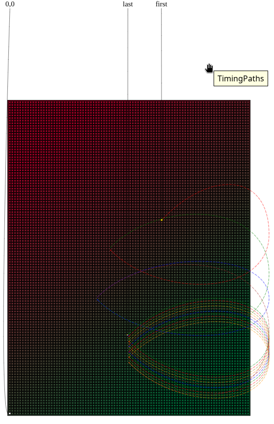
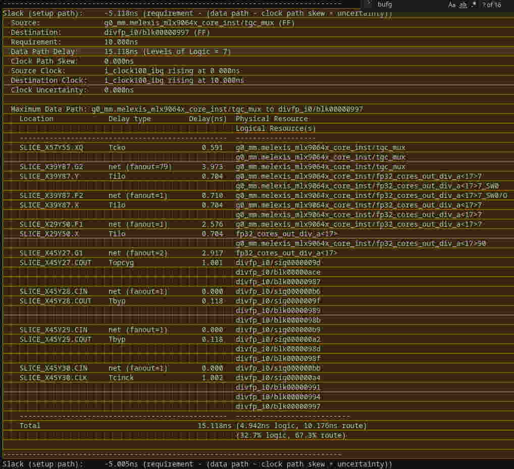
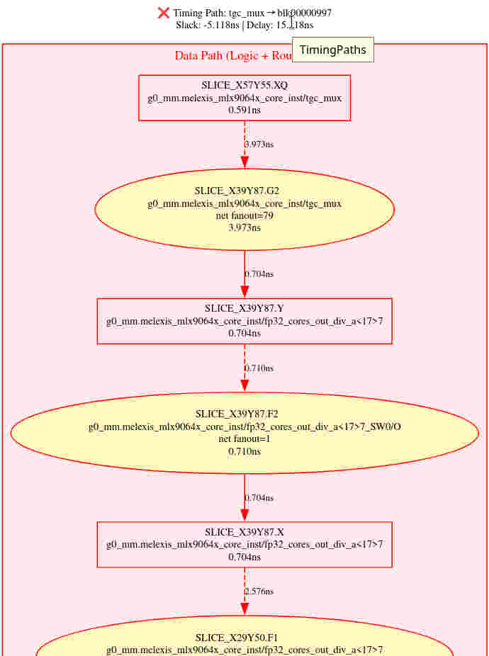
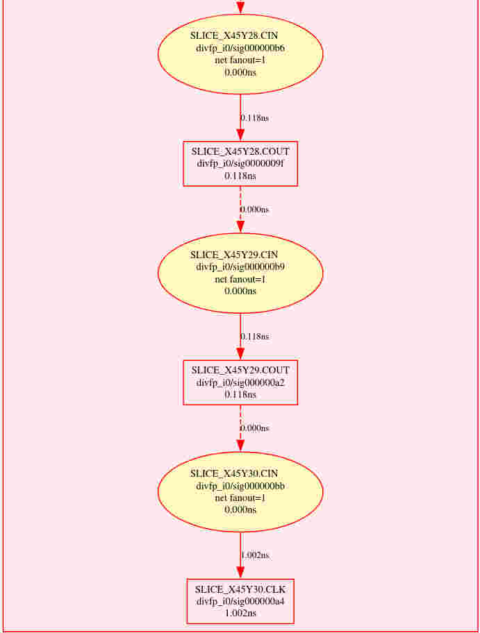

# Update - fast fixes (tested on VSCodium and Xilinx ISE 14.7):
- SVG output to file (in VSCodium installation)
- SVG Up-Down direction
- Add slices and edges

# Xilinx Timing Report Analyzer

> NOTE: Every code and doc in this repo is created by **Github Copilot CLI** w/ **claude-sonnet-4.5** model

A purely AI Generated VSCode extension for offline analyzing Xilinx .twr (Timing Report) files and highlighting and visualizing critical timing paths. You can typically use it for dealing with .twr files generated by Xilinx tools calling from third-party environments(like *NI LabVIEW FPGA*, etc) where you don't have Vivado installed.

## Features

- **📊 Interactive Timing Graph**: Visualize timing paths with zoom/pan support
- **🎯 Smart Path Highlighting**: Automatic highlighting of timing paths at cursor position
- **🔍 Detailed Hover Information**: Comprehensive timing data on hover
- **⚡ Three-Path Visualization**: Shows source clock, data path, and destination clock separately
- **🖱️ Zoom & Pan Controls**: Mouse wheel zoom, click-drag pan, keyboard shortcuts
- **🎨 Color-Coded Paths**: Failed paths in red, met paths in green, distinct clock paths
- **📝 Dual Format Support**: Works with both Vivado and ISE .twr files

## Quick Start

## Usage

### Opening TWR Files
1. Open any `.twr` file in VSCode
2. The file is automatically recognized and syntax-highlighted

### Viewing Timing Graphs
1. Place cursor on any timing path in the `.twr` file
2. **Option 1**: Click the preview button (📊) in the editor toolbar
3. **Option 2**: Right-click → "Open Timing Graph to the Side"
4. **Option 3**: Press `Ctrl+Shift+P` → "Xilinx: Show Timing Graph"

### Interactive Graph Controls
- **Mouse Wheel**: Zoom in/out (zooms towards cursor position)
- **Click + Drag**: Pan around the graph
- **+/- Buttons**: Zoom controls in top-right corner
- **Reset Button**: Return to 100% zoom
- **Double-Click**: Reset view
- **Keyboard Shortcuts**:
  - `+` or `=`: Zoom in
  - `-`: Zoom out
  - `0` or `r`: Reset view

### Path Highlighting
- Move cursor to any timing path
- Path automatically highlights with orange background
- Hover over elements for detailed timing information

## Supported File Formats

- **Vivado Timing Reports**: `.twr` files from Vivado 2018.x - 2024.x
- **ISE Timing Reports**: `.twr` files from ISE 14.x

## Graph Visualization

The extension displays timing paths in three distinct sections:

### 1. Source Clock Path (Blue)
- Clock generation and distribution
- From clock source (PLL, MMCM, GTYE4) to launch flip-flop
- Includes all clock buffers (BUFG, BUFGCE) and routing

### 2. Data Path (Red/Green)
- Combinational logic between flip-flops
- All logic cells and routing delays
- Red for failed paths, green for met paths

### 3. Destination Clock Path (Purple)
- Clock path to capture flip-flop
- Clock distribution network
- Shows setup/hold timing requirements

## Known Limitations

- Very large paths (>200 elements) may render slowly
- Hold timing paths not extensively tested
- Clock domain crossing analysis is informational only

## Contributing

Contributions are welcome! To contribute:

1. Fork the repository
2. Create a feature branch (`git checkout -b feature/amazing-feature`)
3. Make your changes
4. Compile and test (`npm run compile` and press F5)
5. Commit your changes (`git commit -m 'Add amazing feature'`)
6. Push to the branch (`git push origin feature/amazing-feature`)
7. Open a Pull Request

## Documentation

Additional documentation is available in the `docs/` directory:
- [Setup Guide](docs/SETUP-COMPLETE.md)
- [Context Menu Features](docs/CONTEXT-MENU-FEATURE.md)
- [Graph Visualization](docs/ENHANCED-VISUALIZATION.md)
- [Issue Fixes](docs/FIXED-ISSUES.md)
- [Format Support](docs/VIVADO-FORMAT-SUPPORT.md)
- [Zoom Controls](docs/ZOOM-SUPPORT.md)

## Author

Created for FPGA timing analysis and debugging, powered by AI.

## Changelog

### v0.1.0 (2026-01-13)
- ✅ Initial release
- ✅ TWR file parsing (Vivado & ISE formats)
- ✅ Interactive timing graph with zoom/pan
- ✅ Three-path visualization (source clock, data, dest clock)
- ✅ Cursor-based path highlighting
- ✅ Hover tooltips with detailed timing info
- ✅ Graphviz-based SVG rendering
- ✅ Mouse wheel zoom and drag-to-pan
- ✅ Keyboard shortcuts (+, -, 0, r)

## Acknowledgments

- **Graphviz** visualization via [@hpcc-js/wasm](https://github.com/hpcc-systems/hpcc-js-wasm)
- Built with **VSCode Extension API**
- Inspired by Xilinx Vivado/ISE timing analyzers
- Created entirely with **GitHub Copilot CLI** and **Claude Sonnet 4.5**

